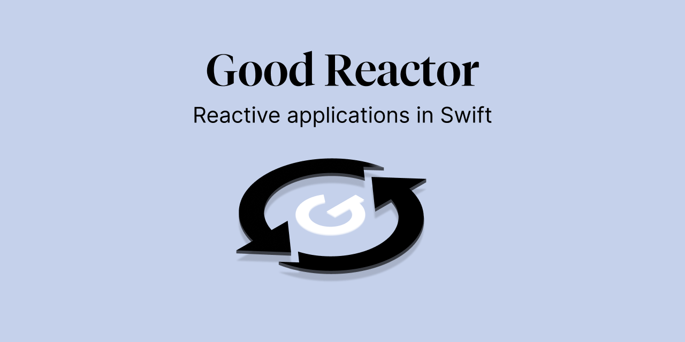

 
# GoodReactor

[Check out the Documentation](https://goodrequest.github.io/GoodReactor/documentation/goodreactor/)

[]() 
[](https://docs.swift.org/swift-book/)
[]()
[](#swiftpackagemanager)

TBD: updated description

# Installation
## Swift Package Manager

Create a `Package.swift` file and add the package dependency into the dependencies list.
Or to integrate without package.swift add it through the Xcode add package interface.

```swift
import PackageDescription

let package = Package(
    name: "SampleProject",
    dependencies: [
        .package(url: "https://github.com/GoodRequest/GoodReactor" .upToNextMajor("2.3.0"))
    ]
)

```

# Usage
## GoodReactor
### ViewModel
In your ViewModel define Actions, Mutations, Destinations and the State

- State defines all data of a View (or a ViewController)
- Action represents user actions that are sent from the View.
- Mutation represents state changes from external sources.
- Destination represents all possible destinations, where user can navigate.

```swift
@Observable final class ViewModel: Reactor {
    enum Action {
        case login(username: String, password: String)
    }

    enum Mutation {
        case didReceiveAuthResponse(Credentials)
    }

    enum Destination {
        case homeScreen
        case errorAlert
    }

    @Observable final class State {
        var username: String
        var password: String
    }
}
```

You can provide the initial state of the view in the `makeInitialState` function.

```swift
func makeInitialState() -> State {
    return State()
}
```

Finally in the `reduce` function you define how `state` changes, according to certain `event`s:

```swift
typealias Event = GoodReactor.Event<Action, Mutation, Destination>

func reduce(state: inout State, event: Event) {
    switch event.kind {
    case .action(.login(...)):
        // ...

    case .mutation:
        // ...

    case .destination:
        // ...
    }
}
```

You can run asynchronous tasks by using `run` and returning the result in form of a `Mutation`.

```swift
func reduce(state: inout State, event: Event) {
    switch event.kind {
    case .action(.login(let username, let password)):
        run(event) {
            let credentials = await networking.login(username, password)
            return Mutation.didReceiveAuthResponse(credentials)
        }

    // ...

    case .mutation(.didReceiveAuthResponse(let credentials)):
        // proceed with login
    }
}
```

You can listen to external changes by `subscribe`-ing to event `Publisher`-s.
You start the subscriptions by calling the `start()` function.

```swift
// in ViewModel:
func transform() {
    subscribe {
        await ExternalTimer.shared.timePublisher
    } map: {
        Mutation.didChangeTime(seconds: $0)
    }
}

// in View (SwiftUI):
var body: some View {
    MyContentView()
        .task { viewModel.start() }
}
```

### View (SwiftUI)

You add the ViewModel as a property wrapper to your view:

```swift
@ViewModel var model: AnyReactor = MyViewModel().eraseToAnyReactor()
```

To access the current `State` you use:

```swift
// read-only access
Text(model.username)

// binding (refactored to a variable for better readability)
let binding = model.bind(\.username, action: { .setUsername($0) })
TextField("Username",  text: binding)
```

To send an event to the ViewModel you call:

```swift
model.send(action: .login(username, password))
model.send(destination: .errorAlert)
```

### UIViewController (UIKit/Combine)

From `UIViewController` (in UIKit, or any other frameworks) you can send actions to ViewModel via Combine:
```swift
myButton.publisher(for: .touchUpInside).map { _ in .login(username, password) }
    .map { .action($0) }
    .subscribe(model.eventStream)
    .store(in: &cancellables)
```

Then use Combine to subscribe to state changes, so every time the state is changed, ViewController can be updated as well:
```swift
reactor.stateStream
    .map { String($0.username) }
    .assign(to: \.text, on: usernameLabel, ownership: .weak)
    .store(in: &cancellables)
```

## Logging
```swift
struct SampleLogger: ReactorLogger {
    
    func logReactorEvent(_ message: Any, level: LogLevel, fileName: String, lineNumber: Int) {
        print("[\(level)] \(message) (\(fileName):\(lineNumber))")
    }
    
}

ReactorConfiguration.logger = SampleLogger()
```

## Previews
You can easily mock state for Xcode Previews by using `Stub` reactor implementation:
```swift
#Preview("Empty") {
    NavigationStack {
        HomeScreen(viewModel: Stub<HomeScreenViewModel> {
            let state = HomeScreenViewModel.State()
            state.items = [] // use empty array to mock empty state
            return state
        }.eraseToAnyReactor())
    }
}
```

# License
GoodReactor repository is released under the MIT license. See [LICENSE](LICENSE.md) for details.

